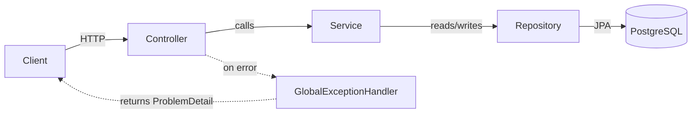
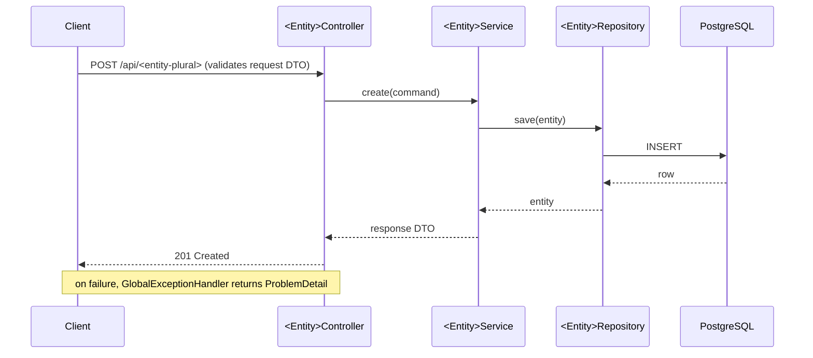

# Spring Boot Scaffold Skill

Generates a complete, convention-compliant Spring Boot 4 project in one shot.

`SKILL_DIR` = directory containing this SKILL.md file.

**Comments in generated code:** minimal, and only where genuinely needed. Never comment WHAT the code
does — names should already make that obvious. Only comment WHY, when there's a hidden constraint or
non-obvious reasoning (e.g. why a table needs an explicit name, why a transaction needs REQUIRES_NEW).
One short line max — never a multi-line comment block. Most generated files need zero comments.

**Pagination:** the scaffold always generates reusable primitives in `shared/pagination/`
(keyset-first). When you wire an actual listing endpoint to them, load `references/pagination.md` in
`SKILL_DIR` for the house pattern (keyset vs offset, the repository/service/controller shape, the
index requirement, and tests).

---

## Step 0 — Gather inputs

Collect from the user's request (ask only for what's missing):

| Field | Required | Example |
|-------|----------|---------|
| `name` | Yes | `job-board` |
| `groupId` | No | `com.example` (default) |
| `description` | Yes | "REST API for job listings and applications" |
| `what_it_is_not` | No | "No frontend. No email. Auth handled upstream." |
| `entities` | No | `["Job", "Application"]` — main domain concepts |
| `extras` | No | additional Spring dependencies (e.g. `kafka`, `redis`, `security`) |
| `outputDir` | No | defaults to `~/projects/<name>` |

---

## Step 1 — Bootstrap via Spring Initializr

```bash
curl -s "https://start.spring.io/starter.zip" \
  -d type=maven-project \
  -d language=java \
  -d bootVersion=4.1.1 \
  -d groupId=<groupId> \
  -d artifactId=<name> \
  -d name=<name> \
  -d description="<description>" \
  -d packageName=<groupId>.<name_as_package> \
  -d javaVersion=25 \
  -d dependencies=web,data-jpa,postgresql,validation,actuator,opentelemetry,flyway,testcontainers,lombok \
  -o /tmp/<name>.zip

unzip /tmp/<name>.zip -d <outputDir>
```

Append any `extras` to the `dependencies` param (comma-separated).

`<name_as_package>` = `name` lowercased with hyphens/spaces stripped (e.g. `job-board` → `jobboard`) —
Java package segments can't contain hyphens. `artifactId`/`name` keep the hyphen; only the package is stripped.

Before running, confirm `4.1.1` is still the latest stable Boot GA and bump if a newer one exists:

```bash
curl -s -H 'Accept: application/json' https://start.spring.io/metadata/client \
  | python3 -c "
import json,sys
vs = [v['id'] for v in json.load(sys.stdin)['bootVersion']['values']]
print([v for v in vs if v.endswith('.RELEASE')])
"
```

**GA only — never scaffold onto a SNAPSHOT, RC, or milestone.** Initializr lists in-flight versions
(`4.1.2.BUILD-SNAPSHOT`) alongside released ones; the filter above keeps only `.RELEASE` entries.
Strip the suffix for the `-d bootVersion=` param — `4.1.1.RELEASE` in the metadata is `4.1.1` on the
request.

### Verify the generated pom before moving on

Boot 4.1 changed what several of these dependency ids resolve to. Open the generated `pom.xml` and
confirm:

| Must be present | Must NOT be present |
|-----------------|---------------------|
| `spring-boot-starter-flyway` (+ `flyway-database-postgresql`) | a bare `org.flywaydb:flyway-core` dependency |
| `spring-boot-starter-opentelemetry` | the community `io.opentelemetry.instrumentation:opentelemetry-spring-boot-starter` |
| `org.testcontainers:testcontainers-postgresql`, `-junit-jupiter`, `-grafana` (test scope) | the unprefixed 1.x coordinates `org.testcontainers:postgresql` / `:junit-jupiter` / `:grafana` |
| `spring-boot-starter-*-test` slices (`-webmvc-test`, `-data-jpa-test`, `-flyway-test`, `-opentelemetry-test`) | a direct `spring-boot-starter-test` declaration (the slices pull it in transitively in 4.1) |

Flyway is wired through the **Boot starter**, never `flyway-core` directly — the starter is what brings
in Boot's Flyway auto-configuration and the matching `flyway-database-postgresql` module for the
selected database. If a newer Flyway is needed, override `flyway.version` in `<properties>`; never
add `flyway-core` by hand.

`testcontainers-grafana` arrives because `opentelemetry` is selected — it's the Grafana **LGTM** stack
container, wired up in Step 4b.

Every Testcontainers module carries a `testcontainers-` prefix since 2.0. The old unprefixed
coordinates still resolve — they just stop at 1.21.4 forever, which is how a project ends up silently
a major version behind. Boot 4.1's BOM pins Testcontainers **2.0.5**; never override
`testcontainers.version` by hand. The `spring-testing` skill's `references/containers.md` holds the
full 1.x → 2.x coordinate map and the commands that verify it.

---

## Step 2 — Restructure packages into feature slices

Delete the default generated main package contents (keep only the main class). Leave `src/test/java/`
alone for now — `TestcontainersConfiguration` and `Test<MainClass>Application` are kept and edited in
Step 4b.

Create the following structure under `src/main/java/<groupId>/<name>/`:

```
<name>/
├── <entity1>/              # one package per domain entity
│   ├── <Entity1>.java             (JPA @Entity — Lombok-annotated)
│   ├── <Entity1>Controller.java
│   ├── <Entity1>Service.java
│   ├── <Entity1>Repository.java   (extends ListCrudRepository; JpaRepository if it paginates)
│   └── dto/
│       ├── <Entity1>Request.java   (record + validation annotations)
│       └── <Entity1>Response.java  (record)
├── shared/
│   ├── exception/
│   │   ├── ErrorKind.java              (transport-neutral failure categories)
│   │   ├── BaseException.java          (carries kind + title; every domain exception extends it)
│   │   ├── ResourceNotFoundException.java
│   │   ├── InvalidCursorException.java
│   │   └── GlobalExceptionHandler.java
│   ├── pagination/        # reusable paging primitives (keyset-first) — always generated
│   │   ├── CursorPage.java        (keyset response record)
│   │   ├── PagedResponse.java     (offset response record — fallback)
│   │   └── PageCursor.java        (opaque cursor codec)
│   └── config/            # cross-cutting @Configuration — starts empty, add only when needed
└── <MainClass>Application.java
```

If no entities given, create a `shared/` package only and leave feature slices for the user.

---

## Step 3 — Write the shared files

**The rule:** one `@ExceptionHandler` for the whole domain hierarchy, never one per concrete
exception. A new exception must be handled correctly by virtue of extending `BaseException` — nothing
else to remember. Per-type handler methods mean a forgotten registration turns an ordinary business
error into a 500 that compiles, passes tests, and only shows up in production.

### `ErrorKind.java`

```java
public enum ErrorKind {
    NOT_FOUND,
    INVALID_INPUT,
    CONFLICT,
    FORBIDDEN
}
```

Failure categories in domain terms, not HTTP terms — services throw these without knowing they're
being called over HTTP, and the same exception still means something from a Kafka consumer or a
scheduled job. `GlobalExceptionHandler` is the only place that translates a kind into a status code.
Add constants as the domain needs them; a kind that genuinely doesn't fit gets its own handler method
(see the escape hatch below).

### `BaseException.java`

```java
public abstract class BaseException extends RuntimeException {

    private final ErrorKind kind;
    private final String title;

    protected BaseException(ErrorKind kind, String title, String message) {
        super(message);
        this.kind = kind;
        this.title = title;
    }

    public ErrorKind getKind() { return kind; }

    public String getTitle() { return title; }
}
```

### `ResourceNotFoundException.java`

```java
public class ResourceNotFoundException extends BaseException {
    public ResourceNotFoundException(String resource, Object id) {
        super(ErrorKind.NOT_FOUND, "Resource Not Found", resource + " not found: " + id);
    }
}
```

### `InvalidCursorException.java`

```java
public class InvalidCursorException extends BaseException {
    public InvalidCursorException(String cursor) {
        super(ErrorKind.INVALID_INPUT, "Invalid Cursor", "Invalid pagination cursor: " + cursor);
    }
}
```

### `GlobalExceptionHandler.java`

Uses `ProblemDetail` (RFC 9457) — no custom error POJOs:

```java
@ControllerAdvice
public class GlobalExceptionHandler extends ResponseEntityExceptionHandler {

    private static final Logger log = LoggerFactory.getLogger(GlobalExceptionHandler.class);

    @ExceptionHandler(BaseException.class)
    ProblemDetail handleDomain(BaseException ex) {
        var pd = ProblemDetail.forStatusAndDetail(statusFor(ex.getKind()), ex.getMessage());
        pd.setTitle(ex.getTitle());
        return pd;
    }

    @Override
    protected ResponseEntity<Object> handleMethodArgumentNotValid(
            MethodArgumentNotValidException ex, HttpHeaders headers,
            HttpStatusCode status, WebRequest request) {
        var pd = ProblemDetail.forStatusAndDetail(HttpStatus.BAD_REQUEST, "Validation failed");
        pd.setTitle("Invalid Request");
        pd.setProperty("errors", ex.getFieldErrors().stream()
            .map(e -> e.getField() + ": " + e.getDefaultMessage())
            .toList());
        return handleExceptionInternal(ex, pd, headers, status, request);
    }

    @ExceptionHandler(Exception.class)
    ProblemDetail handleGeneric(Exception ex) {
        log.error("Unhandled exception", ex);
        var pd = ProblemDetail.forStatusAndDetail(
            HttpStatus.INTERNAL_SERVER_ERROR, "An unexpected error occurred");
        pd.setTitle("Internal Server Error");
        return pd;
    }

    private static HttpStatus statusFor(ErrorKind kind) {
        return switch (kind) {
            case NOT_FOUND -> HttpStatus.NOT_FOUND;
            case INVALID_INPUT -> HttpStatus.BAD_REQUEST;
            case CONFLICT -> HttpStatus.CONFLICT;
            case FORBIDDEN -> HttpStatus.FORBIDDEN;
        };
    }
}
```

Notes on the shape, so it doesn't get "improved" back:

- **`extends ResponseEntityExceptionHandler` is load-bearing.** Without it, the catch-all
  `@ExceptionHandler(Exception.class)` wins over Spring's own exception handling —
  `ExceptionHandlerExceptionResolver` runs before `DefaultHandlerExceptionResolver` — and malformed
  JSON returns 500 instead of 400, an unknown URL 500 instead of 404, a wrong method 500 instead of
  405, each with a spurious ERROR log line. The base class declares `@ExceptionHandler` for 18
  specific Spring MVC types, which beat `Exception.class` on specificity and each get their correct
  status as a `ProblemDetail`.
- Validation is an **`@Override`**, not a second `@ExceptionHandler`. Declaring both a standalone
  `@ExceptionHandler(MethodArgumentNotValidException.class)` and inheriting the base class's mapping
  is an ambiguous mapping and fails at startup. The override also brings
  `HandlerMethodValidationException` — what Boot 4 throws for `@Valid` on `@RequestParam` and
  `@PathVariable` — along for free.
- `handleExceptionInternal` is what returns the body, so async dispatch and the base class's response
  bookkeeping stay intact. Don't hand-roll `ResponseEntity.status(status).body(pd)`.
- Do not set `spring.mvc.problemdetails.enabled` alongside this. Boot's own
  `ProblemDetailsExceptionHandler` is `@ConditionalOnMissingBean(ResponseEntityExceptionHandler.class)`,
  so it already backs off — the property is a no-op here and only confuses the next reader.
- `handleGeneric` returns a **fixed** detail string and logs the real exception. Never put
  `ex.getMessage()` in the response for an unexpected failure — that's how SQL fragments, constraint
  names, and internal paths reach the client.
- Explicit SLF4J `Logger`, not Lombok's `@Slf4j` — house rule is no Lombok on controller-layer classes.
- The `switch` is exhaustive over the enum with no `default`, so adding an `ErrorKind` constant without
  mapping it is a compile error rather than a runtime surprise.
- **Escape hatch:** Spring dispatches to the most specific `@ExceptionHandler`, so a single exception
  that needs a bespoke response (extra `ProblemDetail` properties, a non-standard status) can still get
  its own method without disturbing this one.

---

## Step 3b — Write the pagination primitives (`shared/pagination/`)

Always generate these three files — they're generic and cost nothing unused. Keyset is the default
style; `PagedResponse` is the offset fallback. See `references/pagination.md` for how to wire an
endpoint to them.

### `CursorPage.java`

```java
public record CursorPage<T>(List<T> content, String nextCursor, boolean hasNext) {

    public static <E, T> CursorPage<T> of(Window<E> window, Function<E, T> mapper) {
        String nextCursor = window.hasNext() && !window.isEmpty()
            ? PageCursor.encode(window.positionAt(window.size() - 1))
            : null;
        return new CursorPage<>(window.stream().map(mapper).toList(), nextCursor, window.hasNext());
    }
}
```

### `PagedResponse.java`

```java
public record PagedResponse<T>(
        List<T> content, int page, int size,
        long totalElements, int totalPages, boolean last) {

    public static <T> PagedResponse<T> of(Page<T> page) {
        return new PagedResponse<>(page.getContent(), page.getNumber(), page.getSize(),
            page.getTotalElements(), page.getTotalPages(), page.isLast());
    }
}
```

### `PageCursor.java`

```java
public final class PageCursor {

    // the one place opaque-cursor <-> keyset-position encoding lives; keeps controllers clean
    private static final ObjectMapper MAPPER = new ObjectMapper().registerModule(new JavaTimeModule());
    private static final TypeReference<Map<String, Object>> KEYS = new TypeReference<>() {};

    private PageCursor() {}

    public static ScrollPosition decode(String cursor) {
        if (cursor == null || cursor.isBlank()) return ScrollPosition.keyset();
        try {
            return ScrollPosition.forward(MAPPER.readValue(Base64.getUrlDecoder().decode(cursor), KEYS));
        } catch (IllegalArgumentException | IOException ex) {
            throw new InvalidCursorException(cursor);
        }
    }

    public static String encode(ScrollPosition position) {
        if (!(position instanceof KeysetScrollPosition keyset)) {
            throw new IllegalArgumentException("Only keyset positions can be encoded as a cursor");
        }
        try {
            return Base64.getUrlEncoder().withoutPadding()
                .encodeToString(MAPPER.writeValueAsBytes(keyset.getKeys()));
        } catch (JsonProcessingException ex) {
            throw new IllegalStateException("Failed to encode cursor", ex);
        }
    }
}
```

`ScrollPosition`, `Window`, and `KeysetScrollPosition` are `org.springframework.data.domain.*` —
first-class keyset scrolling, no third-party pagination library needed.

---

## Step 4 — Write the Testcontainers base class

Under `src/test/java/<groupId>/<name>/`:

```java
import org.testcontainers.junit.jupiter.Container;
import org.testcontainers.junit.jupiter.Testcontainers;
import org.testcontainers.postgresql.PostgreSQLContainer;
import org.testcontainers.utility.DockerImageName;

@SpringBootTest(
    webEnvironment = SpringBootTest.WebEnvironment.RANDOM_PORT,
    properties = {
        "management.otlp.metrics.export.enabled=false",
        "management.tracing.export.enabled=false",
        "management.logging.export.otlp.enabled=false"
    })
@Testcontainers
public abstract class BaseIntegrationTest {

    @Container
    @ServiceConnection
    static PostgreSQLContainer postgres =
        new PostgreSQLContainer(DockerImageName.parse("postgres:18-alpine"));
}
```

Before writing the file, confirm `18-alpine` is still the current Postgres major:

```bash
curl -s "https://hub.docker.com/v2/repositories/library/postgres/tags/18-alpine" \
  | python3 -c "import json,sys; d=json.load(sys.stdin); print(d['name'], d['last_updated'][:10])"
```

`@Testcontainers` is required — it's the JUnit 5 extension that actually starts the static
`@Container` before the test run; `@ServiceConnection` only wires the connection details, it does
not start anything. All integration tests extend this class.

The `properties` disable OTLP export so tests don't spam connection warnings against a collector that
isn't running, and so no test pays for starting the LGTM image. These are the Boot 4.1 keys, verified
against the 4.1.1 configuration metadata — the pre-4.1 spellings `management.otlp.tracing.export.enabled`
and `management.otlp.logging.export.enabled` are deprecated and must not be used. Observability is
exercised in dev via `spring-boot:test-run` (Step 4b), not in the integration test suite.

Testcontainers 2.x shapes: `PostgreSQLContainer` comes from `org.testcontainers.postgresql` (the
`org.testcontainers.containers.*` classes are deprecated shims), the container classes are no longer
self-generic — no `<?>` — and they take a `DockerImageName`, never a raw `String`.

This is the whole testing surface the scaffold generates: one base class, one container. Everything
past it — Redis/Kafka/RabbitMQ/LocalStack containers, unit vs integration routing, the Boot 4 test
API (`@MockitoBean`, `MockMvcTester`, `RestTestClient`), and writing the tests themselves — belongs
to the **`spring-testing`** skill. Point the user there in the Step 11 report rather than growing
this step.

---

## Step 4b — Wire the Grafana LGTM stack for local dev

Initializr generates `TestcontainersConfiguration` and `Test<MainClass>Application` in `src/test/java/`.
**Keep both** — they're how `./mvnw spring-boot:test-run` gives you Postgres plus a full observability
backend with zero config. Edit `TestcontainersConfiguration` to pin the image tags (Initializr writes
`:latest`, which violates the pin rule):

```java
@TestConfiguration(proxyBeanMethods = false)
class TestcontainersConfiguration {

    @Bean
    @ServiceConnection
    LgtmStackContainer grafanaLgtmContainer() {
        return new LgtmStackContainer(DockerImageName.parse("grafana/otel-lgtm:0.33.1"));
    }

    @Bean
    @ServiceConnection
    PostgreSQLContainer postgresContainer() {
        return new PostgreSQLContainer(DockerImageName.parse("postgres:18-alpine"));
    }
}
```

`LgtmStackContainer` (`org.testcontainers.grafana`) runs the whole Grafana LGTM stack in one
container — Loki (logs), Grafana (dashboards), Tempo (traces), and Prometheus (metrics, standing in
for Mimir), fronted by an OpenTelemetry Collector on 4317/4318. Boot 4.1 ships three
connection-details factories for it
(`GrafanaOpenTelemetryMetricsContainerConnectionDetailsFactory`, the tracing equivalent, and
`GrafanaOtlpLoggingContainerConnectionDetailsFactory`), so a single `@ServiceConnection` points
metrics, traces, **and** logs at the container's mapped OTLP port. Do not set any
`management.*.otlp.*` endpoint property in a dev profile — the service connection wins and hardcoding
one breaks it.

Before writing the file, confirm `0.33.1` is still the newest `grafana/otel-lgtm` tag:

```bash
curl -s "https://hub.docker.com/v2/repositories/grafana/otel-lgtm/tags?page_size=5&ordering=last_updated" \
  | python3 -c "import json,sys; print([t['name'] for t in json.load(sys.stdin)['results']])"
```

Run it with:

```bash
./mvnw spring-boot:test-run
```

The container logs `Access to the Grafana dashboard: http://localhost:<mapped-port>` on startup —
open that for live traces, metrics, and logs from the running app. The image is ~1 GB on first pull.

This container is deliberately **not** in `BaseIntegrationTest` — integration tests assert behaviour,
not telemetry, and shouldn't pay a 1 GB image start.

---

## Step 5 — Write `application.yml`

Replace the generated `application.properties` with `application.yml`:

```yaml
spring:
  application:
    name: <name>
  jpa:
    hibernate:
      ddl-auto: validate
    open-in-view: false
  data:
    web:
      pageable:
        default-page-size: 20
        max-page-size: 100   # hard cap — an uncapped ?size= is a DoS vector

management:
  endpoints:
    web:
      exposure:
        include: health,info,metrics
  endpoint:
    health:
      show-details: when-authorized
  # OTLP export via spring-boot-starter-opentelemetry — override the endpoint per environment.
  # Ignored under `spring-boot:test-run`: the LGTM @ServiceConnection supplies the endpoints.
  otlp:
    metrics:
      export:
        url: ${OTEL_EXPORTER_OTLP_ENDPOINT:http://localhost:4318}/v1/metrics
  opentelemetry:
    tracing:
      export:
        otlp:
          endpoint: ${OTEL_EXPORTER_OTLP_ENDPOINT:http://localhost:4318}/v1/traces
    logging:
      export:
        otlp:
          endpoint: ${OTEL_EXPORTER_OTLP_ENDPOINT:http://localhost:4318}/v1/logs
  tracing:
    sampling:
      probability: 1.0   # sample everything in dev; lower in production
```

The OTLP endpoints default to a local collector (`localhost:4318`) and are overridable via the
`OTEL_EXPORTER_OTLP_ENDPOINT` env var — point it at the LGTM stack, a standalone collector, or a
vendor. With nothing listening the app still starts; the exporters just log periodic connection
warnings, so this is safe as a default. `spring-boot-starter-opentelemetry` exports what Micrometer
already instruments (HTTP, JDBC, and logs carrying trace/span IDs).

**Three prefixes, three export paths — these are the Boot 4.1 spellings:**

| Signal | Property | Path |
|--------|----------|------|
| Metrics | `management.otlp.metrics.export.url` | Micrometer `OtlpMeterRegistry` |
| Traces | `management.opentelemetry.tracing.export.otlp.endpoint` | OTel SDK |
| Logs | `management.opentelemetry.logging.export.otlp.endpoint` | OTel SDK |

The flat `management.otlp.tracing.*` and `management.otlp.logging.*` keys are deprecated in 4.1 —
never generate them. To switch a signal off entirely: `management.otlp.metrics.export.enabled`,
`management.tracing.export.enabled`, `management.logging.export.otlp.enabled`.

`ddl-auto: validate` does not create tables — it only checks that entity mappings match an existing
schema. **Flyway** owns the schema: the `flyway` dependency in Step 1 resolves to
`spring-boot-starter-flyway` on Boot 4.1 and, because Postgres is selected, adds
`flyway-database-postgresql`. Flyway runs migrations on startup; Hibernate then validates the entities
against the resulting tables. Never add `org.flywaydb:flyway-core` directly — the starter owns that
transitively along with the auto-configuration.

### Initial migration

Write `src/main/resources/db/migration/V1__init.sql` with `CREATE TABLE` DDL matching each entity's
fields (types, `NOT NULL`, PK, unique constraints). This is what makes `validate` pass and the app
start. If no entities were given, create the empty `db/migration/` directory and leave the first
migration to the user.

---

## Step 5b — Wire OTLP log export

The `logging.export.otlp.endpoint` above configures an exporter, but Boot ships **no Logback
appender** — without these three pieces the log endpoint exports nothing while traces and metrics
work fine. Add all three.

**1. The appender dependency**, version-matched to the OTel API Boot pins (4.1.1 pins
`opentelemetry.version` 1.62.0 → `2.28.1-alpha`). It is not managed by the BOM, so the version is
explicit; every release of this artifact carries `-alpha` and that is expected:

```xml
<dependency>
    <groupId>io.opentelemetry.instrumentation</groupId>
    <artifactId>opentelemetry-logback-appender-1.0</artifactId>
    <version>2.28.1-alpha</version>
</dependency>
```

**2. `src/main/resources/logback-spring.xml`:**

```xml
<?xml version="1.0" encoding="UTF-8"?>
<configuration>
    <include resource="org/springframework/boot/logging/logback/base.xml"/>

    <appender name="OTEL" class="io.opentelemetry.instrumentation.logback.appender.v1_0.OpenTelemetryAppender"/>

    <root level="INFO">
        <appender-ref ref="CONSOLE"/>
        <appender-ref ref="OTEL"/>
    </root>
</configuration>
```

**3. `shared/config/InstallOpenTelemetryAppender.java`:**

```java
@Component
class InstallOpenTelemetryAppender implements InitializingBean {

    private final OpenTelemetry openTelemetry;

    InstallOpenTelemetryAppender(OpenTelemetry openTelemetry) {
        this.openTelemetry = openTelemetry;
    }

    @Override
    public void afterPropertiesSet() {
        OpenTelemetryAppender.install(this.openTelemetry);
    }
}
```

Installing from `InitializingBean` is what keeps early log lines carrying trace context — the
appender must not be installed before the auto-configured `OpenTelemetry` bean exists.

Anything past this — resource attributes, vendor auth headers, `@Observed`, production sampling, and
the runbook that proves all three signals actually land in Grafana — belongs to the **`otel-setup`**
skill.

---

## Step 6 — Write Dockerfile

```dockerfile
# Build stage
FROM eclipse-temurin:25-jdk-alpine AS builder
WORKDIR /app
COPY .mvn .mvn
COPY mvnw pom.xml ./
RUN ./mvnw dependency:go-offline -q
COPY src ./src
RUN ./mvnw package -DskipTests -q

# Runtime stage
FROM eclipse-temurin:25-jre-alpine
RUN addgroup -S app && adduser -S app -G app
WORKDIR /app
COPY --from=builder /app/target/*.jar app.jar
USER app
EXPOSE 8080
ENTRYPOINT ["java", "-jar", "app.jar"]
```

---

## Step 7 — Write GitHub Actions CI

`.github/workflows/ci.yml`:

```yaml
name: CI

on:
  push:
    branches: [main]
  pull_request:
    branches: [main]

concurrency:
  group: ${{ github.workflow }}-${{ github.ref }}
  cancel-in-progress: true

jobs:
  test:
    runs-on: ubuntu-latest
    steps:
      - uses: actions/checkout@v7
      - uses: actions/setup-java@v6
        with:
          java-version: '25'
          distribution: 'temurin'
          cache: maven
      - name: Run tests
        run: ./mvnw test

  build:
    needs: test
    runs-on: ubuntu-latest
    steps:
      - uses: actions/checkout@v7
      - uses: actions/setup-java@v6
        with:
          java-version: '25'
          distribution: 'temurin'
          cache: maven
      - name: Build JAR
        run: ./mvnw package -DskipTests
      - uses: actions/upload-artifact@v7
        with:
          name: app-jar
          path: target/*.jar
```

Before writing the file, confirm these are still the newest major tags — action majors move faster
than anything else in this scaffold, and a stale pin here is invisible until a runner deprecates it:

```bash
for r in actions/checkout actions/setup-java actions/upload-artifact; do
  printf '%s: ' "$r"
  curl -s "https://api.github.com/repos/$r/releases/latest" \
    | python3 -c "import json,sys; print(json.load(sys.stdin)['tag_name'])"
done
```

Pin the **major** only (`@v7`, not `@v7.0.1`) — that's what picks up security patches without a
manual bump, and it's still a pin, unlike `@main`.

---

## Step 8 — Write project AGENTS.md

```markdown
# <name>

## What this is
<description>

## What it is NOT
<what_it_is_not>

## Package structure
<groupId>.<name>/
├── <entity1>/
│   ├── <Entity1>            (JPA @Entity)
│   ├── <Entity1>Controller
│   ├── <Entity1>Service
│   ├── <Entity1>Repository
│   └── dto/
├── shared/
│   ├── exception/
│   └── config/
└── <MainClass>Application

## Key domain concepts
<list entities and their definitions>

## How to run
./mvnw spring-boot:test-run   # preferred — starts Postgres + Grafana LGTM via Testcontainers
./mvnw spring-boot:run        # app on :8080, expects Postgres and an OTLP collector already running

## External dependencies
- PostgreSQL 18 (local via Testcontainers)
- Grafana LGTM stack (local via Testcontainers) — OTLP metrics, traces, logs
```

---

## Step 9 — Write architecture decision records (docs/adr/)

Record *why* the project is shaped the way it is, so decisions live next to the code and don't rot in
a wiki. Each ADR is one short [MADR](https://adr.github.io/madr/)-style file. Generate two files.

`docs/adr/0001-package-by-feature-monolith.md` — pre-written, reflecting the actual scaffold decision.
Fill `<today>` with the current date:

```markdown
# ADR-0001 — Package-by-feature monolith over microservices

- Status: Accepted
- Date: <today>

## Context
Small, early-stage project owned by one team. Cohesion and speed of iteration matter more than
independent deployability right now — there's no operational need to split services yet.

## Decision
Ship a single Spring Boot deployable, packaged by feature (one package per domain entity, each with
its own `controller → service → repository`) plus a `shared` package for the exception hierarchy and
config. Keep feature boundaries clean so any one can be extracted into its own service later.

## Consequences
- + Simple to run, test, and reason about; no distributed-systems tax up front.
- + Clean seams make a future service extraction mechanical rather than surgical.
- − Boundary discipline is manual today (nothing enforces it). Revisit with Spring Modulith if the
    app grows enough to need enforced module boundaries.
```

`docs/adr/template.md` — a blank skeleton to copy for the next decision, so every ADR stays consistent:

```markdown
<!-- Copy this file to docs/adr/NNNN-short-title.md for the next decision. -->
# ADR-NNNN — <short title>

- Status: Proposed | Accepted | Superseded
- Date: <yyyy-mm-dd>

## Context
<The forces at play — what problem, what constraints, what's being weighed.>

## Decision
<The choice made, stated plainly.>

## Consequences
- + <positive outcome>
- − <cost or trade-off accepted>
```

---

## Step 10 — Write README.md

`AGENTS.md` (Step 8) is for AI context — implementation gaps, package layout, dev detail. `README.md`
is the human-facing front door: what a hiring manager, collaborator, or video viewer sees first on
GitHub. Keep them distinct — don't just duplicate AGENTS.md's content into README.md.

The section order below is deliberate — problem → mental model → run it → understand it → decisions —
so the README also reads as the outline for a teaching video.

```markdown
# <name>

<description>

## What this is
<2–3 lines: the problem this solves and who'd reach for it. Not a feature list.>

## Architecture

<Diagram 1 — component flow. Nodes generated from the actual `entities`.>


<Diagram 2 — request flow for one representative entity.>


## Tech stack
Java 25 · Spring Boot 4.1 · Spring Framework 7 · PostgreSQL 18 · Flyway · OpenTelemetry (OTLP) · Grafana LGTM · Testcontainers · Docker

## Getting started
```bash
./mvnw spring-boot:test-run   # app on :8080 + Postgres and Grafana LGTM started for you
./mvnw test                   # integration tests against a real Postgres via Testcontainers
```
`test-run` prints the Grafana URL on startup — traces, metrics, and logs from the running app land
there with no extra configuration.

## Project structure
Packaged by feature — one package per domain entity, each with its own
`controller → service → repository`; a `shared` package holds the exception hierarchy and config.
No layer skipping, entities never leave the service layer.

## API
<One example curl per entity's create endpoint, generated from `entities`, e.g.:>
```bash
curl -X POST localhost:8080/api/<entity-plural> \
  -H "Content-Type: application/json" \
  -d '{"...": "..."}'
```

## Architecture decisions
- [ADR-0001](docs/adr/0001-package-by-feature-monolith.md) — Package-by-feature monolith over microservices

## Testing
Integration tests run against a real PostgreSQL via Testcontainers — `./mvnw test`, no manual DB setup.

## Status
<Short, honest bullet list of what's built vs. what's genuinely not implemented yet — pull this from
the same gaps noted in AGENTS.md's "what's scaffolded vs. what's still to build" section, rephrased
for a reader who isn't going to dig through the code to find out.>
```

Fill in the real entity names everywhere before writing the file — substitute `<Entity>`,
`<entity-plural>`, and the API DTO fields with the actual values from Step 2/3. Don't leave any
`<entity>`/`<entity-plural>` literal placeholders in the written file. If there are multiple entities,
draw all of them as sibling controller→service→repository lanes in Diagram 1, and pick one entity for
the Diagram 2 sequence. Label every arrow with what flows across it, and keep each diagram to one
concern — component structure in Diagram 1, request timing in Diagram 2.

---

## Step 11 — Report

Tell the user:

- Full path to the generated project
- Package structure created
- That `docs/adr/` seeds the first decision record, and the README ships with two Mermaid diagrams
  that render on GitHub
- That `./mvnw spring-boot:test-run` boots the app with Postgres and the Grafana LGTM stack attached,
  and the Grafana URL is printed in the startup logs
- What to do next: add domain logic to feature slices, run `./mvnw test` to verify Testcontainers works
- That log export needs the Logback appender wired (Step 5b) — traces and metrics work without it,
  logs do not
- That the **`otel-setup`** skill verifies all three signals actually land in Grafana, and owns
  resource attributes, vendor auth, and production sampling
- That the **`spring-testing`** skill takes over from here — it writes the actual tests, adds any
  container beyond Postgres, and audits the suite against the Boot 4 test API
